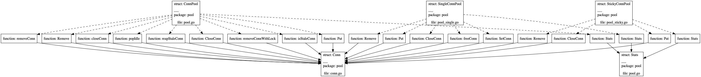

### 介绍
visualization是基于golang提供的ast模块，将项目中struct间的依赖以图形化的方式展示出来,
主要展示struct的两种依赖关系
* struct之间的成员包含关系
* struct之间的方法的调用关系。

### 使用
* 注意：本项目依赖graphviz，需要提前在机器上安装。另外，本项目尚未支持Windows环境。
* 你可以在mac或者是Linux环境下使用

把项目Git clone到本地build后，执行如下命令完成解析
```shell script
./main --path xxx
```
其中xxx是需要分析的项目目录，程序会自动在当前的data目录下生成两个png文件,分别是struct_visualization.png和
function_visualization.png。

例如我现在分析[go-redis](https://github.com/go-redis/redis) 这个项目的pool模块的struct之间的依赖关系。
```shell script
./main --path  /Users/lintong/go/src/github.com/go-redis/redis --packages pool
```
生成的效果如为:




* 命令执行的参数如下 
```
  -all
    	显示域的全部字段 (default true)
  -detail
    	显示详细信息 (default true)
  -h	获取帮助
  -packages string
    	设置需要分析的模块
  -path string
    	设置分析的go目录 (default ".")
  -structs string
    	设置需要分析的struct
```
